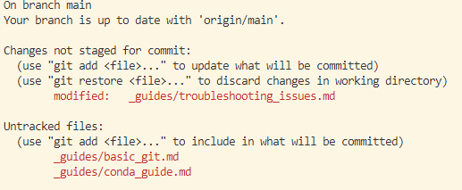
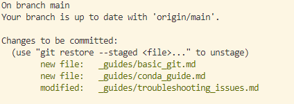
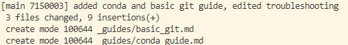
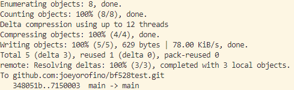

# Git and GitHub

Though sometimes used interchangeably, git and GitHub have no formal relationship
and are distinct concepts. 

Git is a version control system that allows you to track changes to your code and 
collaborate with others. Git was developed by Linus Torvalds, the creator of Linux, 
to track development on the linux kernel as a replacement for another source-control
system.

GitHub is a web-based developer platform that allows you to store and manage your
git repositories. It is one of the most popular platforms for hosting and sharing
open source software. 

## Git

Generally speaking, git is a way to track your code by recording what changes you've
made and enabling you to revert to previous versions if needed. By making a codebase
into a repository, git will automatically detect when you make changes to your code
and allow you to "save" the state of your code at a particular point in time. 

This is useful for both iteration and collaboration as you can have no fear altering
your codebase when developing and easily share your code with others when you 
are ready to by directly sharing the repository URL with others. 

You can think of this as akin to "saving" a word document, but instead of overwriting
your previous document, git will let you keep track of every incremental change 
as a snapshot. 

## Git Workflow

The basic workflow for using git is as follows:

1. Initialize a git repository
2. Stage files to be committed
3. Commit changes to the repository
4. Push changes to GitHub
...
5. Pull changes from GitHub

Git has an incredible number of features and capabilities, but the above workflow is
the basic process you will use most of the time. 

## Git Commands

### git init

`git init` will initialize a new git repository in the current directory. On
the backend, this will create a hidden `.git` directory that contains all the
information needed to track changes to your code. Once you've initialized a 
directory as a git repository, you will often want to add a remote repository
on GitHub to push your code to. This will keep your version of code in sync with
the version on GitHub. This is how GitHub enables you to collaborate with others
or even yourself on your code. 

Typically, you will be initializing your code base as a github repository and then
creating a remote repository on GitHub. After you have run `git init`, you can 
use the GitHub website to create a new repository and follow the instructions
to link your local repository to the remote repository on GitHub. 

This process will look something like below assuming you have already created a
remote repository on GitHub (it will tell you the remote repository URL to use):

```bash
git init
git add <files to be added>
git commit -m "Initial commit"
git branch -M main
git remote add origin <remote_repository_url>
git push -u origin main
```

This would initialize a new git repository, add all files to the repository, 
commit the changes, set the remote repository, and push the changes to the remote
repository on GitHub. After this, you should be able to see all of your current
files on GitHub. 

### git status

`git status` will show you the current state of your repo. It will show you
what files have been modified, what files have been staged, and what files
have not been staged. If you're ever unsure of what's going on, you can always
run `git status` to see what's happening.



If you look at the above example, I'll point out a few basic things to note:

1. There is a single file (_guides/troubleshooting_issues.md) that has had 
    changes, but has not been staged
2. There are two files that are new and not previously tracked (_guides/basic_git.md and _guides/conda_guide.md)
    that have been created and not staged.

### git add

`git add` will stage files to be committed. In the above example, there are three
files that have changes that have not been recorded since the last commit. A
git add command would stage these files to be committed. 




### git commit

`git commit` will take a snapshot of the currently staged changes and saves them as 
a new commit in the history of the repository. Commits are generally considered
the fundamental unit of a git project. They are snapshots or milestones that record
a major or important change in your codebase. 

In general, you will be using the `git commit -m "<message>"` command to commit 
your changes. The message should be a succinct description of the changes you've 
made. You can think of the commit message as akin to commenting in coding. A good 
commit message should at minimum enable a third party to understand what changes 
you've made and potentially why the changes were made. 

For example, continuing with the the above example, my git commit may look like:

```bash
git commit -m 'added conda and basic git guide, edited troubleshooting'
```



### git push

`git push` will push your changes or commits to the remote repository. This will 
update the remote repository with your changes. At this point in our working 
example, our changes are only recorded in our local repository. 



After you've pushed to your remote repository, you can view your changes on GitHub
by simply navigating to your repository via browser. 

### git pull

`git pull` will pull the latest changes from the remote repository to your local
repository. This will update your local repository with the latest changes from
the remote repository. 

This is one of the ways in which git enables collaboration. Different users can
push their changes to the same remote repository and pull the latest changes from the
remote repository made by others. 

This is also how you can use GitHub and Git to work on your project in multiple locations
while ensuring that you always have the latest version of your code. If you have a
GitHub repository, you can clone your repository to a different location and pull the
latest changes from the remote repository to keep your local repository up to date. 

For example, if you have a GitHub repository on the cluster and you want to work on your
project at home, you can clone your repository to your local computer and pull the
latest changes from the remote repository to keep your local repository up to date. 

### git clone

`git clone` will clone a remote repository to your local machine. This will create a
local copy of the remote repository on your machine. This is useful if you want to
work on your project in multiple locations or if you want to make a backup of your
project. 

You can then make changes from any number of locations and push them to your single
remote repository. Using `git push` and `git pull`, you can ensure that all locations
are always in sync with the remote repository. 

## Git and Bioinformatics

We will be using Git and GitHub to manage our code and data for this course. This
will become second nature to you and will be an invaluable tool for your future
research endeavors. Many publications are now requiring that code and data be
stored in a version control system, and Git / Github are the most popular combination
of tools for this purpose. 

In addition, you can think of Git and GitHub as a more robust way to save your
work. Although a side benefit, this can often be a lifesaver when you're working
on a project and something goes wrong or you need to revert to a previous version.